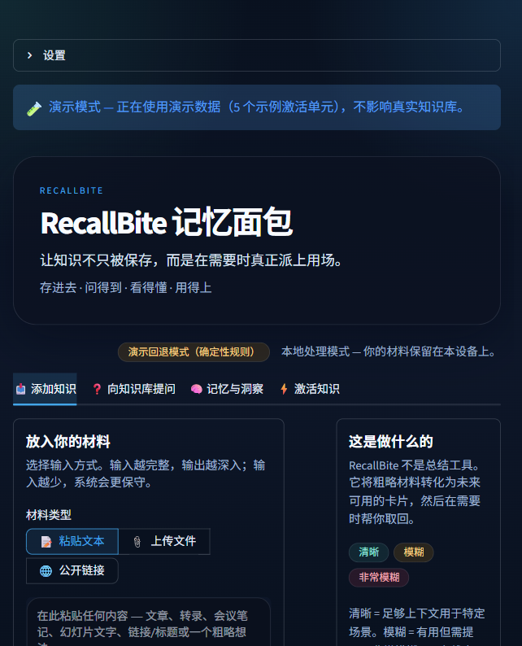
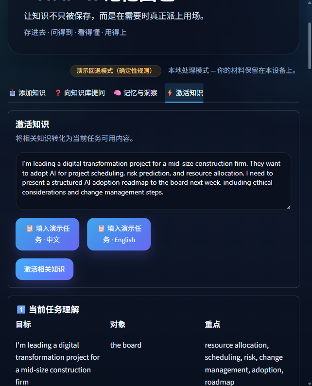
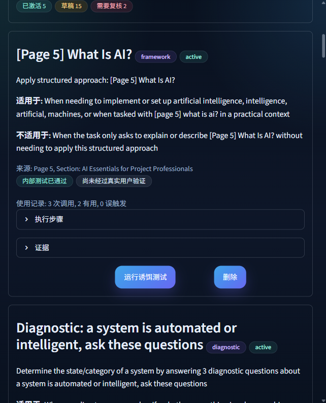
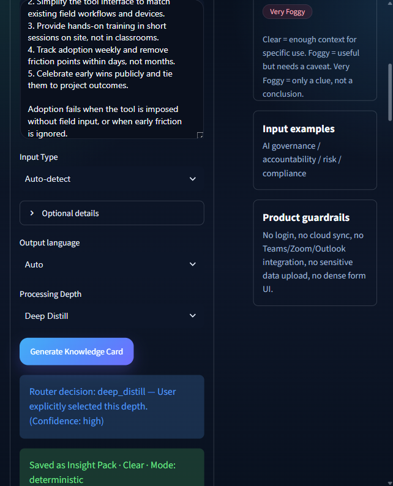
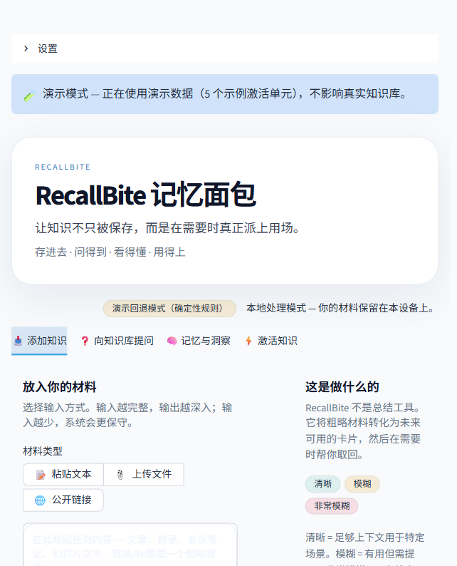

# RecallBite 记忆面包

**Put what you have learned to work when it matters.**

RecallBite is a local-first personal knowledge activation prototype for professionals. It helps decide how saved material should be retained, then brings relevant knowledge into real tasks with its sources, boundaries, and missing context intact.

> 当前版本以 Python 和 Streamlit 构建，用于验证从材料保存、理解、分层处理到任务中激活的完整产品路径。

<p align="center">
  
</p>

---

## Why RecallBite

We keep learning.

A useful judgement from a forum, a method from a workshop, an idea from an article, or a note saved after a webinar may genuinely change how we think. Yet when the next real task begins, what remains is often vague:

- I remember reading something about this.
- I may have saved an article.
- There was a method that could help, but I cannot remember its name.

The material still exists. The connection between that material and the task in front of us has been lost.

RecallBite explores a different question:

> How can saved knowledge remain traceable, retain its future use, and participate in the right task at the right time?

---

## What RecallBite does

RecallBite processes saved material at different depths and retains the result in three forms:

| Knowledge form | Purpose | What is retained |
|---|---|---|
| **Source** | Preserve and verify | Original content, source, page references, and metadata |
| **Memory** | Remember future use | Key judgement, possible use cases, and confidence notes |
| **Skill** | Reuse a method | Triggers, anti-triggers, execution steps, boundaries, and evidence |

When a new task appears, users describe the current problem and intended outcome. RecallBite retrieves potentially relevant knowledge and explains:

- why the knowledge was selected;
- where it came from;
- when it should and should not be used;
- what the available material can support;
- what information is still missing.

The selected knowledge can then enter a structured working draft while the user retains the final judgement.

---

## Core workflow

```text
Add material
    ↓
Recommend processing depth
    ↓
Preserve source / retain memory / distil method
    ↓
Review triggers, boundaries, and evidence
    ↓
Describe a real task
    ↓
Activate relevant knowledge
    ↓
Create a source-aware working draft
```

### 1. Add material

RecallBite accepts:

- PDF;
- DOCX;
- PPTX;
- URL;
- plain text;
- short notes or rough ideas.

### 2. Choose the processing depth

The prototype recommends a processing depth based on the structure, method density, and boundary clarity of the material. Users can change the recommendation.

| Processing depth | Intended use | Typical output |
|---|---|---|
| **Archive** | Preserve material for future reference | Traceable source record |
| **Digest** | Retain key judgements and possible use cases | Memory card |
| **Deep Distill** | Extract a reusable method with conditions and evidence | Memory card and Activation Unit |

### 3. Review an Activation Unit

An **Activation Unit** is an executable knowledge unit extracted through Deep Distill. It can include:

- **Triggers**: when the method may help;
- **Anti-triggers**: when the method should remain inactive;
- **Execution steps**: how the method is applied;
- **Boundaries**: what the method cannot support;
- **Evidence spans**: where the method came from;
- **Decoy tests**: checks against false-positive triggering.

AI proposes the structure. The user decides whether to keep, reject, revise, or activate it.

### 4. Activate knowledge in a real task

RecallBite analyses the current task, retrieves relevant memories and Activation Units, and produces a structured output containing:

1. task understanding;
2. selected methods and matching signals;
3. a working deliverable;
4. quality checks;
5. supported and unsupported areas;
6. sources and evidence;
7. a feedback path.

<p align="center">
  
</p>

---

## Memory cards

Memory cards express retained knowledge according to the completeness of the available material.

| Card type | Use | Behaviour |
|---|---|---|
| **Insight Pack** | Rich, well-supported material | Provides concrete applications, wording, and questions |
| **Use Card** | Material with useful but incomplete context | Offers cautious application guidance |
| **Clue Card** | Fragmentary input | Preserves a lead without presenting it as a conclusion |

Memory-card type describes the confidence and completeness of a retained insight. Processing depth describes how far the source material is analysed. The two concepts serve different purposes.

---

## Quick start

### Requirements

- Python 3.11 or later
- Windows, macOS, or Linux

### Clone the repository

```bash
git clone https://github.com/YuhaoQIAN/RecallBite.git
cd RecallBite
```

### Create a virtual environment

#### Windows PowerShell

```powershell
py -m venv .venv
.\.venv\Scripts\Activate.ps1
```

#### macOS or Linux

```bash
python3 -m venv .venv
source .venv/bin/activate
```

### Install dependencies

```bash
pip install -r requirements.txt
```

### Start RecallBite

```bash
streamlit run app.py
```

Open `http://localhost:8501` if the browser does not open automatically.

---

## Demo workspace

The application includes a resettable demo workspace built from simulated and public material.

A recommended walkthrough is:

1. load the demo workspace from **Settings**;
2. inspect the example source material;
3. compare **Archive**, **Digest**, and **Deep Distill**;
4. review an Activation Unit and its evidence;
5. enter a sample task;
6. inspect the selection reasons, sources, boundaries, and missing context;
7. review the generated working draft;
8. submit feedback or reset the workspace.

Demo seed data is stored separately from runtime and test data so that the walkthrough can be restored to a clean state.

---

## Optional LLM configuration

RecallBite can run in a deterministic local demo mode without an API key. An OpenAI-compatible provider can optionally be configured for enhanced analysis.

Copy the environment template:

#### Windows PowerShell

```powershell
Copy-Item .env.example .env
```

#### macOS or Linux

```bash
cp .env.example .env
```

Then edit `.env`:

```dotenv
RECALLBITE_LLM_API_KEY=your-key
RECALLBITE_LLM_PROVIDER=openai
RECALLBITE_LLM_MODEL=gpt-4o
```

Provider and model support depends on the implementation and endpoint configuration. Never commit `.env` or API keys to the repository.

> **Data notice:** Enabling an external LLM may send input to the selected service. Do not submit client data, sensitive information, or non-public material to an unapproved provider. Use a locally hosted model or an approved environment where required.

---

## Architecture

```text
Streamlit UI
    │
    ├── Input and document parsing
    │     ├── PDF
    │     ├── DOCX
    │     ├── PPTX
    │     ├── URL
    │     └── Plain text
    │
    ├── Material analysis
    │     ├── Processing-depth recommendation
    │     ├── Memory-card generation
    │     └── Deep Distill
    │
    ├── Knowledge activation
    │     ├── Retrieval
    │     ├── Trigger and anti-trigger checks
    │     ├── Boundary checks
    │     └── Evidence-aware output
    │
    └── Local storage
          ├── JSON demo and runtime data
          └── SQLite knowledge base
```

### Technology

| Layer | Technology |
|---|---|
| User interface | Streamlit |
| Application logic | Python |
| Document parsing | PyMuPDF, python-docx, python-pptx, BeautifulSoup4 |
| Optional model access | OpenAI-compatible API |
| Local storage | JSON and SQLite |
| Testing | pytest |

---

## Repository structure

```text
RecallBite/
├── app.py
├── requirements.txt
├── .env.example
├── .streamlit/
│   └── config.toml
├── data/
│   └── demo_seed_units.json
├── src/
│   ├── parsers/
│   ├── analyzers/
│   ├── generator.py
│   ├── activation.py
│   ├── activation_unit.py
│   ├── trigger_engine.py
│   ├── deep_distill.py
│   ├── au_output.py
│   ├── knowledge_base.py
│   ├── retrieval.py
│   ├── llm_client.py
│   ├── i18n.py
│   └── storage.py
├── tests/
├── screenshots/
├── README.md
└── LICENSE
```

---

## Testing

Run the test suite from the application directory:

```bash
pytest tests/ -v
```

The test suite covers core parsing, storage, distillation, triggering, retrieval, and activation behaviour. Test counts may change as the prototype evolves, so the README does not treat a fixed case count as a release claim.

---

## Current prototype scope

The current version is designed for local, single-user product validation.

### Implemented in the prototype

- local material ingestion;
- parsing for supported formats;
- processing-depth recommendation;
- source, memory, and Activation Unit generation;
- trigger and anti-trigger review;
- task-based knowledge retrieval;
- evidence, boundary, and missing-context output;
- local demo workspace;
- Chinese and English interface support.

### Not yet implemented

- user accounts and enterprise identity;
- cloud synchronisation;
- multi-user collaboration;
- production database deployment;
- Teams, Outlook, or enterprise knowledge-platform integration;
- organisation-wide access control, audit, monitoring, and backup;
- production security and Responsible AI approval.

These are productisation requirements rather than claims of the current prototype.

---

## Data and responsible use

- The demo uses simulated and public material.
- Client data and unauthorised internal data are outside the intended demo scope.
- Sources and evidence are retained for review.
- Missing support is surfaced instead of being silently filled.
- Similar keywords alone should not trigger an unrelated method.
- AI recommendations remain subject to user review.
- External model use depends on the selected provider, approval status, and configuration.

RecallBite is a decision-support prototype. Users remain responsible for validating source material, evaluating applicability, and making final professional judgements.

---

## Product direction

The local application demonstrates the end-to-end path from saving material to activating knowledge in a task.

A future production version could evolve through controlled stages:

1. validate usefulness with a small group of approved test users;
2. add identity, permissions, governed storage, and auditability;
3. deploy in an approved cloud or internal environment;
4. integrate with existing knowledge and AI collaboration workflows;
5. evaluate whether repeated, well-supported experience can become reusable organisational Skills.

The long-term direction is a personal memory layer embedded in AI collaboration, available where reading, writing, meeting preparation, and professional judgement already happen.

---

## Screenshots

| Home | Activation Unit library |
|---|---|
|  |  |

| Deep Distill review | Light theme |
|---|---|
|  |  |

---

## License

Licensed under the [MIT License](LICENSE).
